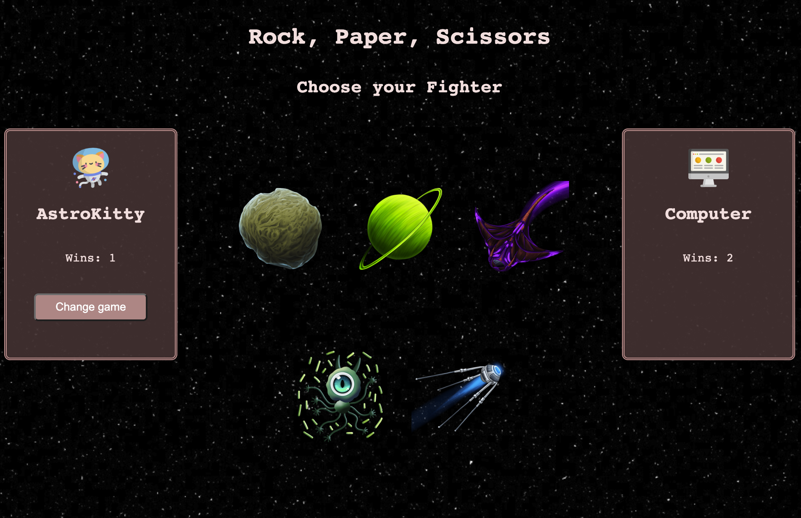

# rock-paper-scissors

## Abstract:
- I built an app that allows users to play rock, paper, scissors against a computer player. There are two modes: classic and space. The classic mode consists of the rock, paper, scissors. The space mode consists of 5 choices: probe, planet, alien, manta ray, and moon rock.
- Users are able to see both their score and the computer's score.
- Users have the ability to switch game types at anytime.

## Installation Instructions:
1. On your local machine, open the terminal and run `git clone git@github.com:Espressogoddess/rock-paper-scissors.git`. 
    - This clones down the repository to your local machine.
1. In terminal, run `cd rock-paper-scissors` to move into the project directory.
1. In terminal, `open index.html` to launch the application in the web browser.
1. Play the game to your heart's content.

## Preview of App:

## Context:
This project took roughly 13 hours to complete during my 5th week of the Turing program.

## Contributors:
[Amber](https://github.com/espressogoddess)

## Learning Goals:
- Solidify and demonstrate my understanding of DRY JavaScript and event delegation to handle similar event listeners.
- Understand the difference between the data model and how the data is displayed on the DOM
- Use my problem solving process to break down large problems, solve things step by step, and trust myself to not rely on an outside “answer” to a logical challenge